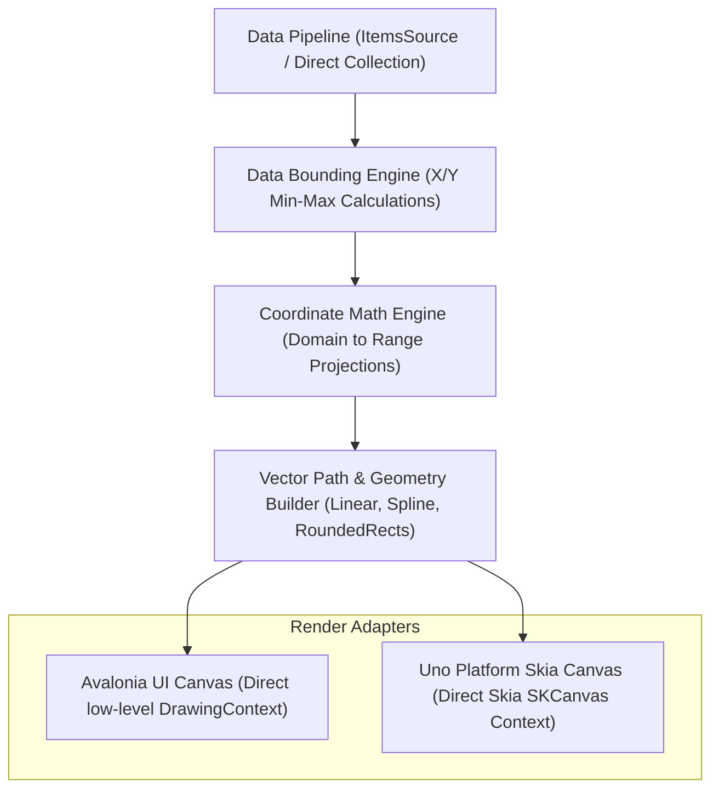

# Architecture

ProCharts is engineered to provide extreme performance and exceptional visual aesthetics for modern UI applications. To achieve these goals, it departs from standard XAML charting methodologies—which typically instantiate hundreds of framework UI elements (such as `Path`, `Line`, and `Rectangle` controls)—and instead employs a **direct vector drawing pipeline** decoupled from platform layout cycles.

---

## The Core Philosophy: Direct Vector Rendering

In typical UI controls, the composition of a chart involves adding visual elements to the logical and visual trees. This results in heavy overhead:
- **Measure/Arrange Passes**: The framework must continuously traverse the logical tree to measure and arrange individual elements whenever the parent layout shifts or new points arrive.
- **Memory Overhead**: Each framework control allocates substantial heap memory, leading to garbage collection (GC) pauses during high-frequency telemetry streaming.
- **Render Thread Bottlenecks**: The framework must serialize thousands of individual elements for the graphics hardware.

ProCharts eliminates this overhead by treating the charting canvas as a single unified drawing surface. Platform-specific adapters intercept the framework's low-level rendering cycle (`DrawingContext` in Avalonia UI and standard Skia drawing calls in Uno Platform) to execute a single, optimized rendering sweep. All gridlines, data series, splines, fills, tooltips, and legends are drawn as pure vector paths in a single pass.



---

## Visual Layer Stack Composition

During each rendering pass, ProCharts separates rendering logic into four distinct layers. These layers are stacked back-to-front to maintain visual isolation and control over opacity, blending, and clipping:

| Layer | Responsibility | Technical Implementation |
| --- | --- | --- |
| **1. Background** | Canvas boundaries, shadows, glassmorphism templates, and border drawing. | Renders a container rectangle using custom backdrop filter effects and solid or gradient borders. |
| **2. Gridlines & Axes** | Horizontal and vertical coordinate axes, ticks, labels, and background grid patterns. | Calculates grid steps dynamically based on coordinate span, and renders translucent single-stroke paths and native text elements. |
| **3. Data Series** | Visual representations of data points (lines, areas, grouped clustered bars, pie segments). | Iterates through series data, constructs high-performance composite geometries (such as splines or rounded rectangles), and applies HSL-based gradient fills. |
| **4. Interactivity** | Hover tracking circles, dashed trackball intercept indicators, and floating glassmorphic tooltip boxes. | Computes mouse pointer intersections against series geometries, updates animation interpolation bounds, and renders interactive elements over the data. |

---

## Mathematical Coordinate Transformations

To project numerical points from your business logic domain into coordinate pixels on a physical viewport, ProCharts implements a high-precision translation engine in `CoordinateTransform.cs`.

Let the data domain boundaries be defined by $[X_{\min}, X_{\max}]$ and $[Y_{\min}, Y_{\max}]$, and the target physical viewport boundaries (in pixels) be defined by $[\text{Left}, \text{Right}]$ and $[\text{Top}, \text{Bottom}]$.

### 1. Linear Projection
For standard linear scale projections, the pixel coordinates $(P_x, P_y)$ for any data coordinate $(X, Y)$ are mapped using:

$$P_x = \text{Left} + (X - X_{\min}) \times \frac{\text{Width}}{X_{\max} - X_{\min}}$$

$$P_y = \text{Bottom} - (Y - Y_{\min}) \times \frac{\text{Height}}{Y_{\max} - Y_{\min}}$$

Where:
$$\text{Width} = \text{Right} - \text{Left}$$
$$\text{Height} = \text{Bottom} - \text{Top}$$

### 2. Logarithmic Scaling
For highly skewed datasets, such as radio frequency or seismic metrics, logarithmic scaling is applied to compress coordinate distributions:

$$X_{\text{scaled}} = \log_{10}(X)$$

$$P_x = \text{Left} + (X_{\text{scaled}} - \log_{10}(X_{\min})) \times \frac{\text{Width}}{\log_{10}(X_{\max}) - \log_{10}(X_{\min})}$$

*(Note: Data values $\le 0$ are automatically filtered or clamped to prevent mathematical division-by-zero exceptions.)*

### 3. Reversed Coordinates
In specialized domains, such as marine depth sounding or geological drilling, plotting values downwards is essential. When reversed coordinates are flagged on an axis, the projection formula is inverted:

$$P_y = \text{Top} + (Y - Y_{\min}) \times \frac{\text{Height}}{Y_{\max} - Y_{\min}}$$

### 4. Inverse Coordinate Mapping (Hit-Testing)
To translate a screen-based physical pointer click or hover event at pixel $(P_x, P_y)$ back into the logical data domain coordinates $(X, Y)$ for tooltips and data query operations, ProCharts solves the linear equations in reverse:

$$X = X_{\min} + (P_x - \text{Left}) \times \frac{X_{\max} - X_{\min}}{\text{Width}}$$

$$Y = Y_{\min} + (\text{Bottom} - P_y) \times \frac{Y_{\max} - Y_{\min}}{\text{Height}}$$

---

## Empty Point Filtering Algorithms

Real-world telemetry streams often experience network drops or sensor offline states, resulting in null values or `double.NaN` coordinate declarations. ProCharts implements a robust filtering subsystem to process these gaps elegantly via `EmptyPointMode`:

```
   [Valid Point] ------> [double.NaN Point] ------> [Valid Point]
```

- **`EmptyPointMode.Zero`**:
  Replaces all missing coordinate values with a flat `0.0`. Useful for tracking volumetric flows where inactivity denotes zero output.
  
- **`EmptyPointMode.Gap`**:
  Closes the current vector stroke and starts a new separate segment at the next valid coordinate point. This renders a clean visual gap in the line or area series, informing the operator that no data was gathered during that timeframe.
  
- **`EmptyPointMode.Average`**:
  Computes the arithmetic mean of the closest valid predecessor and successor data points to patch the missing value:
  
  $$Y_{\text{interpolated}} = \frac{Y_{k-1} + Y_{k+1}}{2}$$
  
- **`EmptyPointMode.Interpolate`**:
  Performs high-fidelity linear regression interpolation across the entire width of the gap, tracing a smooth transition line between distant valid boundaries to present a continuous, uninterrupted line flow.
