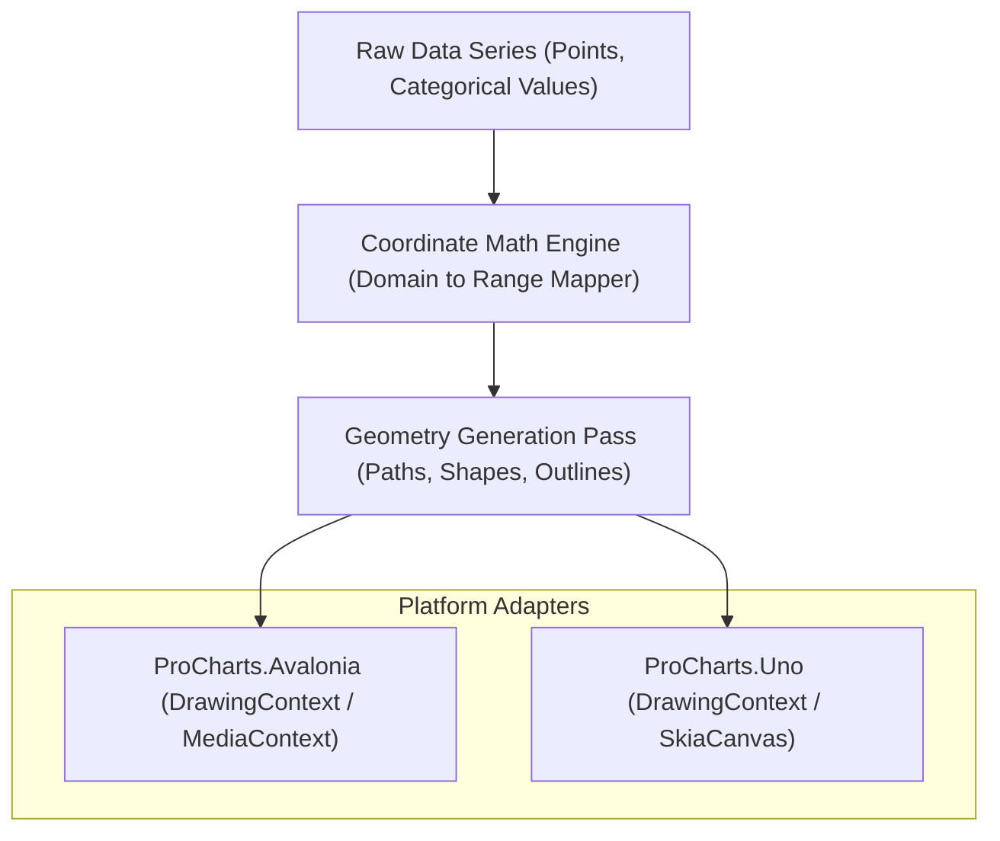

# Architecture

ProCharts is engineered with a performance-first, custom vector drawing pipeline that decouples coordinate math from active platform rendering frameworks. 

## The Vector Drawing Pipeline

## Layer Composition

Each chart control compiles and stacks multiple vector visual layers asynchronously:

1. **Background Layer**: Owns shadows, glassmorphic backdrop filters, and gradient borders.
2. **Gridline Layer**: Draws horizontal and vertical axis markers.
3. **Data Layer**: High-performance drawing of lines, bars, bubbles, or pies.
4. **Interactive Layer**: Manages crosshairs, tooltips, and hover animations.

## Decoupled Coordinate Mapping

To ensure high-precision charts that zoom and scale instantly, coordinate calculations map directly from the real data domain into standard pixel values. 

`CoordinateTransform.cs` converts raw numbers using linear, logarithmic, or datetime scaling equations:

$$\text{PixelCoordinate} = \text{Offset} + \left( \frac{\text{Value} - \text{DomainMin}}{\text{DomainMax} - \text{DomainMin}} \right) \times \text{PixelSpan}$$

By centralizing mathematical calculations, ProCharts guarantees consistent layout output regardless of whether it renders in an Avalonia canvas or an Uno Skia context.
